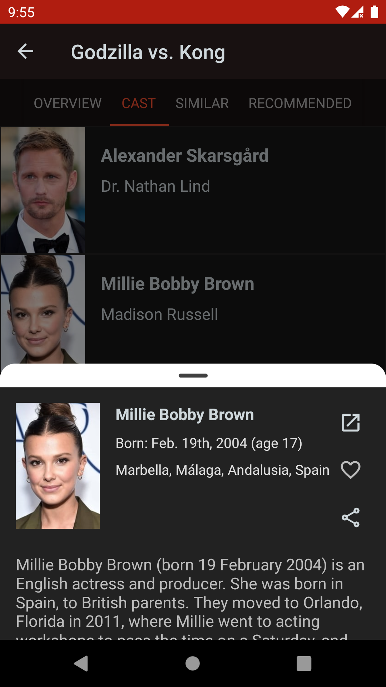

# WatchNext

An app to determine what to watch next on TV.

Built with React Native with my take on a simple [Clean Architecture](https://blog.cleancoder.com/uncle-bob/2012/08/13/the-clean-architecture.html) implementation.

### Getting Started

1. Visit [TheMovieDB](https://www.themoviedb.org/settings/api) and register for an account
2. Create an API key
3. Create a `.env` file (using `.env.template`) and set the `TMDB_API_V3_TOKEN` value to that of the API key
4. Run the following commands one after another in a terminal from the root folder:
 - `npm install`
 - `npx react-native start`

## To run on Android

1. Open the `/android` project in Android Studio
2. From the `File` menu selelect `Sync Project with Gradle Files`
3. Run `npx react-native run-android` in a terminal from the root folder

## To run on iOS

1. Run `npx react-native run-ios` in a terminal from the root folder

To troubleshoot common issues, consider running the following commands in a terminal (from the `ios` folder):

- `brew upgrade cocoapods`
- `pod install`

### Screenshots

